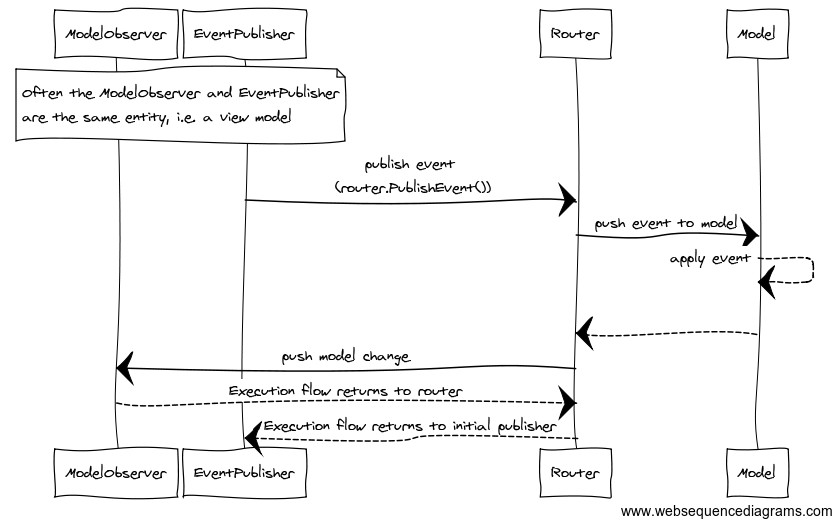

# Dispatch Loop

The dispatch loop exists to make event processing deterministic.
All event and model observation code **must** run within the dispatch loop.

The dispatch loop kicks off once an event is published to the `Router` via `Router.PublishEvent(...)` or an action is run via `Router.RunAction(...)`.
Any time control flow leaves the router, for example to an event or model observation callback, it's possible that further events could be raised.
Such events go onto a backing queue for their respective model.
The dispatch loop continues until all events are processed.

<a name="event-queues"></a>

## Event queues

Each model added to the router has its own event queue.
Every time a call to `Router.PublishEvent()` occurs the event is placed on the queue for the model in question.
Subsequent events could be raised anytime during the dispatch loop, such events get placed on the back of the model's event queue.
This means events published during the dispatch loop are are not processed immediately, they're processed in turn.
This allows the router to finish dealing with the current event, and allows event observers to assume the model state is fit for the event currently being processed.
Event observers need not be concerned with what is in the backing queue, only with the current event and the current state, this makes execution deterministic.
When the current model's event queue is empty, the router will check the queues for other models and continue until all are empty.

## Model updates
The `Router` pushes the model updates to observers from within the dispatch loop.
If any model observer publishes an event it will go onto the event queue for the model in question.
Again, the dispatch loop continues until all events are processed.

> ##### Tip
> The specific workflow the `Router` does on the dispatch loop is called the [event workflow](../advanced-concepts/complete-event-workflow.md).

# Event Pub/Sub

When an event is published to a model using `router.PublishEvent()`, the `Router` will dispatch the model along with the event to all event observers.

Anything can publish an event to the `Router`, anything can observe an event on the `Router`.
Typically things outside the model publish events, and the model observes events and updates it's state when they are received.

<a name="event-observation-signature"></a>

You observe an event by calling `Router.GetEventObservable()`:

``` js
var subscription = router
    .getEventObservable('myModel', 'loginEvent')
    .subscribe(
        (event, eventContext, model) => {
            model.login(event.name);
        }
    );
```

The call to `getEventObservable()` returns an `EventObservable` which can be observed by calling `subscribe()`.
The `subscribe()` method expects a 'observe' callback taking the `event`, the `eventContext` and the `model` (some are optional in .Net, all optional in JS).
See the [complete event workflow](../advanced-concepts/complete-event-workflow.md) for more details on this, particularly the usage of `eventContext` and how you can use it to propagate the event through the the staged event workflow.

Lets look at another example.
Below we see an instance of `Model` being registered, an event `LoginEvent` being published, and an event observer receiving both the event and model instances for processing.
The event observer applies the event to the model.

``` js
class Model {
    login (userName) {
        console.log("logging in " + userName);
    }
}
// create a Router. It can manage multiple models.
var router = new esp.Router();
// register a model by id
router.addModel("myModel", new Model());
// Observe changes to the model.
var eventSubscription1 = router
    .getEventObservable("myModel", "loginEvent")
    .subscribe(
        (event, context, model) => {
            model.login(event.userName);
        }
    );
// publish an event to apply the change to the model and then dispatch the new model
// The router will then dispatch the latest model to observers (if any)
router.publishEvent("myModel", "loginEvent", { userName: "Bob" });

// ... at a later time:
// .dispose() eventSubscription1 to remove the observations on the router
```




> ##### Note
> Above we're performing tasks against the router all within one method.
> This is to demo features of the `Router`.
> Typically (but not always) model observation and event publication happen by different logical components.
> Additionally the `Router` would likely be a singleton per sub-system or application.
> 
> How you use the `Router` to build a fully functional event based system is the focus of [modelling approaches](modelling-approaches/index.md) with [examples](../examples/index.md) providing practical guidance.


> ##### Tip - Attribute/Decorator based event observation
> The .Net and JS APIs have an [attribute/decorator based event wire-up](../advanced-concepts/auto-event-observation.md).
> This removes a lot of the plumbing code seen in the above example.


# Model Observation

TODO 


# Reactive API

Both `router.getEventObservable()` and `router.getModelObservable()` return an observable object.
This is modeled on [RxJs's](https://github.com/Reactive-Extensions/RxJS) observable API but with only a few observable methods included, additionally `onError` semantics are not applicable.

> ##### Why not use Rx? <a name="reactive-api-why-not-rx"></a>
>
>The push based model of Rx is ideal for pub/sub scenarios where state needs to be combined from many differing streams.
>However the full Rx API isn't suitable as introduction of asynchronicity and other methods that would result in state being held in observable streams would break the deterministic staged workflow that the `Router` owns.
>For example, a deferred model change by way of an asynchronous operation would happen outside of the state processing workflow.
>Then there is no guarantee the model would be still in a state suitable once the deferred event arrives.
>Similarly, relational operators combine event streams and store state in observable objects/closures, when a final result yields the underlying model may not be in a state suitable for the target result.

## Extending the API

Given the API is modeled on RX, there is nothing stopping you from extending both `EventObservable` and `ModelObservable` to add additional operators.
Internally this is how operators such as `.filter` and `.map` have been built. For example:

``` js
import {Observable} from '../Observable';
import { Guard } from '../../system';

Observable.prototype.filter = function(predicate) {
    Guard.isDefined(predicate, 'predicate Required');
    var source = this;
    var subscribe =  observer => {
        return source.subscribe(
            (item: T) => {
                if(predicate(item: T)) {
                    observer.onNext(item);
                }
            },
            () => observer.onCompleted()
        );
    };
    return new Observable(subscribe);
};
```

Reference:

* [js](https://github.com/esp/esp-js/blob/master/src/reactive/extMethods/filter.js)