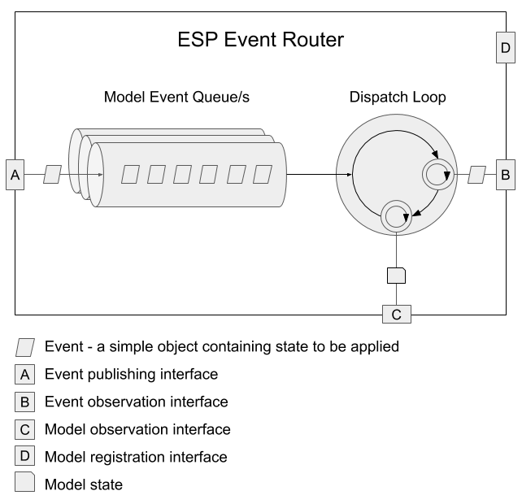

The event router is the heart of an esp application. 
It can be thought of as a reactive non blocking event bus which introduces a concurrency model for all state mutations across all models it manages. 
There is typically one instance of the router and it's used by all models.

The below diagram shows it's core interfaces. 

{: .align-center}

The snippet below shows each interface being used.

 

The registered model will always be some form of JavaScript object, in the above an object literal.
This instance never changes.
This instance can be an [OO model](./04-oo-modeling.md) or a more immutable type managed by plumbing such as [esp-js-polimer](../02-esp-js-polimer/01-index.md).


In practice you tend not to directly interact with the `Router.getModelObservable(...)` and `Router.getEventObservable(...)` APIs, framework code will do that for you.

For the model side, you can the decorator `@observeEvent(observeAtStage)` to wire up functions to the router.

For the view side `RouterProvider` and `ConnectableComponent` (or `connect` function) in [esp-js-react](../03-esp-js-react/01-index.md) can wire a view up via `Router.getEventObservable(...)`.

The [examples](../../03-examples/index.md) show how to do this.



The `Router` needs to manage how the above interactions happen deterministically. 
Given any handler or observer registered with the `Router` could itself publish events or observe other models, the `Router` needs internal event queues per model and a processing loop to do this. 
This loop is called the Dispatch Loop. 

  
## Dispatch Loop

The dispatch loop exists to make event processing deterministic.
All code that changes model state **must** run within the dispatch loop for that model otherwise ESP won't know the object has changed.

The dispatch loop kicks off once an event is published to the `Router` via `Router.PublishEvent(...)` or an action is run via `Router.RunAction(...)`.
Any time control flow leaves the router, for example to an event or model observation callback, it's possible that further events could be raised.
Such events go onto a backing queue for their respective model.
The dispatch loop continues until all events for all models are processed.

### Event Queues

Each model added to the router has its own event queue.
Every time a call to `Router.PublishEvent(...)` occurs the event is placed on the queue for the model in question.
Subsequent events could be raised anytime during the dispatch loop, such events get placed on the back of the model's event queue.
This means events published during the dispatch loop are are not processed immediately, they're processed in turn.
This allows the router to finish dealing with the current event, and allows event observers to assume the model state is fit for the event currently being processed.
Event observers need not be concerned with what is in the backing queue, only with the current event and the current state, this makes execution deterministic, you're only dealing with state change one event at a time.
When the current model's event queue is empty, the router will check the queues for other models and continue until all are empty.

### Model Updates
The `Router` pushes the model updates to observers from within the dispatch loop.
If any model observer publishes an event it will go onto the event queue for the model in question.
Again, the dispatch loop continues until all events are processed.


The specific workflow the `Router` does on the dispatch loop is called the [state change workflow](03-state-change-workflow.md).



## Reactive API

Both `router.getEventObservable()` and `router.getModelObservable()` return an observable object.
This is modeled on [RxJs's](https://github.com/Reactive-Extensions/RxJS) observable API but with only a few observable methods included, additionally `onError` semantics are not applicable.


The push based model of Rx is ideal for pub/sub scenarios where state needs to be combined from many differing streams.
However the full Rx API isn't suitable as introduction of asynchronicity and other methods that would result in state being held in observable streams would break the deterministic staged workflow that the `Router` owns.

For example, a deferred model change by way of an asynchronous operation would happen outside of the [state change workflow](03-state-change-workflow.md).
Then there is no guarantee the model would be still in a state suitable once the deferred event arrives.
Similarly, relational operators combine event streams and store state in observable objects/closures, when a final result yields the underlying model may not be in a state suitable for the target result.

#### Does this matter?
 
Not really, you rarely use the underlying reactive interface. 
[esp-js-polimer](../02-esp-js-polimer/01-index.md) does use RXJS for it's event streams implement as those streams do warrant a full featured reactive API.


