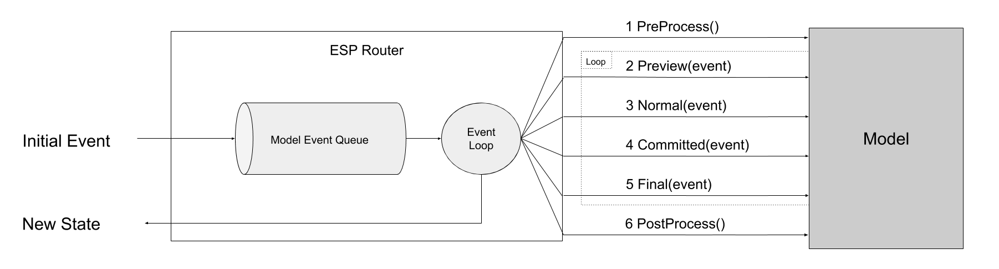

When an event is published to the `Router` it dispatches the event to event observers using a staged approach.
This consists of `preProcess` and `postProcess` hooks per [dispatch loop](./02-event-router.md#dispatch-loop), and a series of observation stages (represented by the `ObservationStage` enumeration) for each event in the queue.
The below diagram shows the flow.
  
{: .align-center}

The staged workflow exists to allow finer control in applying events to the model.
In edge case scenarios a developer may want a given entity to receive an event first, then let other entities receive it.
Another example would be to cancel the event, for example don't process a 'closeFormEvent' if there is unfinished work.
Largely you'll use the default observation stage (`ObservationStage.normal`) and only on rare occasions require the others.

## Stages

### Pre Event Processing
The pre processing stage happens before the event is dispatched to event observers at any of the `ObservationStages`.
Typically this could be done if you need to do some high level stage changes to the model, for example increment a model version, or clear some transient collections.

### Event Observation Stage - Preview
The preview stage exists to give an observer a chance to cancel the event.
This is done by calling `eventContext.cancel()` on the `EventContext` passed to the handling function as the second (and optional) parameter.
Other preview stage observers will still receive the event (if any), however it won't be delivered to observers at `ObservationStage.normal` or `ObservationStage.committed`.

### Event Observation Stage - Normal
The normal stage is where **99% of your processing will take place**.
If you subscribe without a stage the `Router` will default the stage to `ObservationStage.normal`.

An event can not be cancelled at this stage, however it can be committed.
Committing is done by calling `eventContext.commit()` on the `EventContext` passed to the observe callback.
Committing allows a model entity that owns the event to declare the events state has been applied to the model.
You can only commit an event once.

### Event Observation Stage - Committed
Committed stage observers only receive the event if an observer at  `ObservationStage.normal` calls `eventContext.Commit()`.

### Event Observation Stage - Final
Final stage observers only receive the event at the very end, this stage will always run.


[esp-polimer](../02-esp-js-polimer/01-index.md) event streams run at this stage.



### Post Event Processing
In a similar fashion to pre event processing, there is also a post event dispatch hook.
This happens after all events (including any subsequently published by event observers) have been dispatched to observers at the various `ObservationStages`.


You should not expand or contract your model in the post processing stage, it's largely intended for performing validation/aggregations etc. 



## Example

This runnable snippet demonstrates the above concepts.

  See the Pen <a href="https://codepen.io/KeithWoods/pen/NWqqOXJ">
  esp workflow example</a> by Keith (<a href="https://codepen.io/KeithWoods">@KeithWoods</a>)
  on <a href="https://codepen.io">CodePen</a>.

