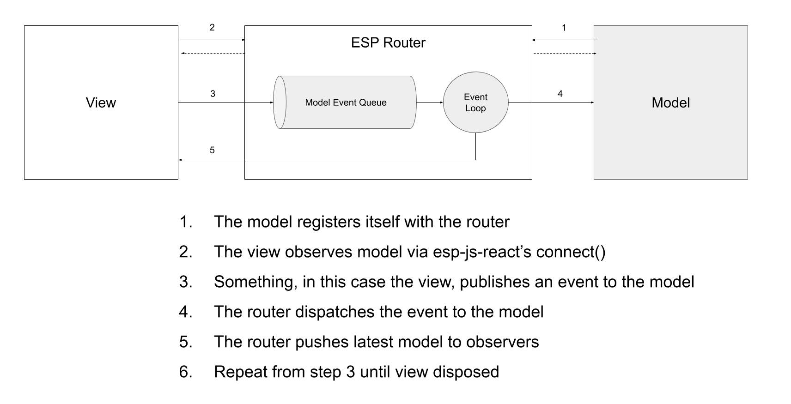

You can register an OO model with the ESP router and use it to manage state. 
ESP will hold that model and invoke it when an event is published to it.
You can use standard OO patterns and abstractions to manage your state.

The below diagram shows a high level view of the interactions. 

{: .align-center}

The below TypeScript snippet shows this in practice (emulating the view).

<p class="codepen" data-height="990" data-theme-id="dark" data-default-tab="js" data-user="KeithWoods" data-slug-hash="JjoQNJq" style="height: 990px; box-sizing: border-box; display: flex; align-items: center; justify-content: center; border: 2px solid; margin: 1em 0; padding: 1em;" data-pen-title="esp-docs-oo-example">
  <span>See the Pen <a href="https://codepen.io/KeithWoods/pen/JjoQNJq">
  esp-docs-oo-example</a> by Keith (<a href="https://codepen.io/KeithWoods">@KeithWoods</a>)
  on <a href="https://codepen.io">CodePen</a>.</span>
</p>
<script async src="https://static.codepen.io/assets/embed/ei.js"></script>
<br />

Some points to note:
* An application can have many models.
* An application can have multiple instances of the same model, as long as the model IDs are different.
  This is handy for applications that have multiple instances of similar views open at the same time, for example trade blotters or order entry screens.
* Models can use the `@observeEvent` decorator to wire up their functions to the router.
* Any changes to the model should be via an event published to the `Router`.
  The only exception is when your invocations are within the model itself.
  I.e. model entities can directly interact with other model entitles using normal OO patterns, the key point is the initial interaction was kicked off with an event.
* The `Router` doesn't care that your model is OO.
  Such models can be added alongside existing models in your system.  

## Asynchronous Operations with OO Models 

To perform asynchronous operations in an OO model you:

1. Make network requests using your chosen network stack (i.e. `fetch`, websocket, rx etc).
1. When the response returns, publish an event to the model containing the result (or error).   

You can do this anywhere within your model, however it's cleaner to put such calls into separate entities that deal with network communications. 
These entities are typically called 'gateways'.
Gateways are simple object that exposes void methods to perform the async request. 
They handle network plumbing, mapping to DTOs, retries (if necessary), and ultimately they publish result events back to the model for processing. 
 
The below **pseudo** code has a simplistic example of a gateway object.

```typescript
 class OrderGateway {
     constructor(private router: Router, private modelId: string) { }
     bookOrder(amount: number): void {
         // Do something async
         fetch('someApi', { /* create the request */ })
             .then(response => {
                 const responseEvent = { /* mapped data */ };
                 this.router.publishEvent(this.modelId, responseEvent)
             })
             .catch(err => {
                 // publish error event if model needs to know
             });
     }
 }
 ```

The below diagram outlines the typical flow in more details.

{: .align-center}

## To OO or Not to OO?
There are some downsides to OO programing in the React world.

The main issue is React is optimised to work with immutable state. 
Specifically, logic used to determine if the virtual DOM should be refreshed, is based on object instance equality checks.
JavaScript does not have the ability to override the the equality operator (`===`), so it's much easier to just check if instances have changed.  

OO models are inherently mutable.
This means their instance never changes. 
View logic needs to work harder to determine if the component should re-render.
In effect that logic needs to inspect leaf nodes of the state and check if the values of those have changed.
If you use OO models, VDOM that's connected to that particular model will always re-render unless you a) implement custom 'should component update' logic, and/or b) use immutable patterns for your leaf nodes.

With either OO or immutable models, these leaf nodes tend to represent inputs, labels, state the users interacts with, i.e. real DOM elements. 
In any case these should be built using immutable APIs as ultimately, they are what represents real DOM bindings and will cause actual DOM mutations.
When an OO model is re-rendered in React, you will tend to traverse as far as the leaf nodes which may cause adverse effects.
These nodes can still be compared efficiently if they use immutable structures, however without plumbing to help you make the mutations it's easy for rendering bugs to creep in.

Immutable models on the other hand require more plumbing to ensure any change results in a new instance. 
Typically with that pattern, the root entity doesn't change, however states that hang off the root do get replaced anytime they are mutated. 
Functions to mutate the state don't typically live on the object holding the state. 
You build plumbing infrastructure to help you implement this pattern. 
This is effectively what [esp-js-polimer](../02-esp-js-polimer/01-index.md) does. 


ESP supports multiple models and they all function independently and connect to the VDOM separately.
You don't have one uber model to rule the entire page.
This reduces any VDOM update scope to only the model that has changed. 

It's also worth noting not all models have views, or have very simplistic views, sometimes it's easier to have a simple class model for those.



The general guidance would be to create immutable models using [esp-js-polimer](../02-esp-js-polimer/01-index.md) for views, and for other models either approach can be used.
