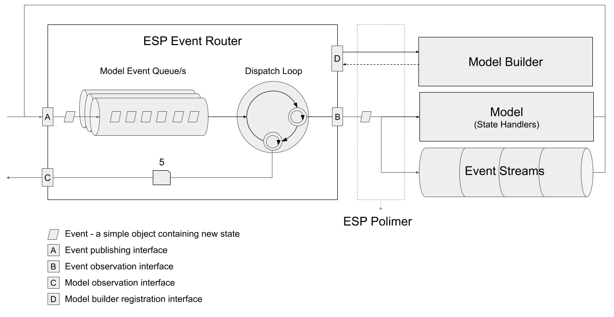

Due to various [issues with OO](../01-esp-js/04-oo-modeling.md#oo-woes) programming in the React world, a more immutable modeling approach was needed. 
ESP Polimer solves that problem. 
Given the underlying ESP `Router` makes no assumptions of how you manage your model, it was straight forward to add plumbing that support immutable patterns into a standalone package, esp-js-polimer.
This package hooks onto the ESP `Router`s API and helps you register an immutable model, register any side effects (aka event streams) and ties your model into the determinstic state management pattern the `Router` provides. 

The below diagram shows polimer as a layer between the router and the model.

{: .align-center}

Overview of the bits:
* [Model (Store)](./02-model-store.md) - an introduction to what consatutes a Model (store) in esp-js-polimer.
* [Model Builder](./02-model-builder.md) - a fluent API that hangs off the `Router`, make it easy to create the pluming required for a new model.
* [Model & State Handlers](./03-state-handlers.md) - the model in a polimer implementation is effectively a root entity with a series of immutable states which hang of it. 
  The state handlers are responsible for updating those states.
* [Event Streams](./04-event-streams.md) - these streams simply have 'event in, event out' semantics. 
  They are RXJS observable streams which are used for side effects and asynchronous operations.   

## External Dependencies



esp-js-polimer relies on lerna, but it does not re bundle it.

TODO update guidance here   

 