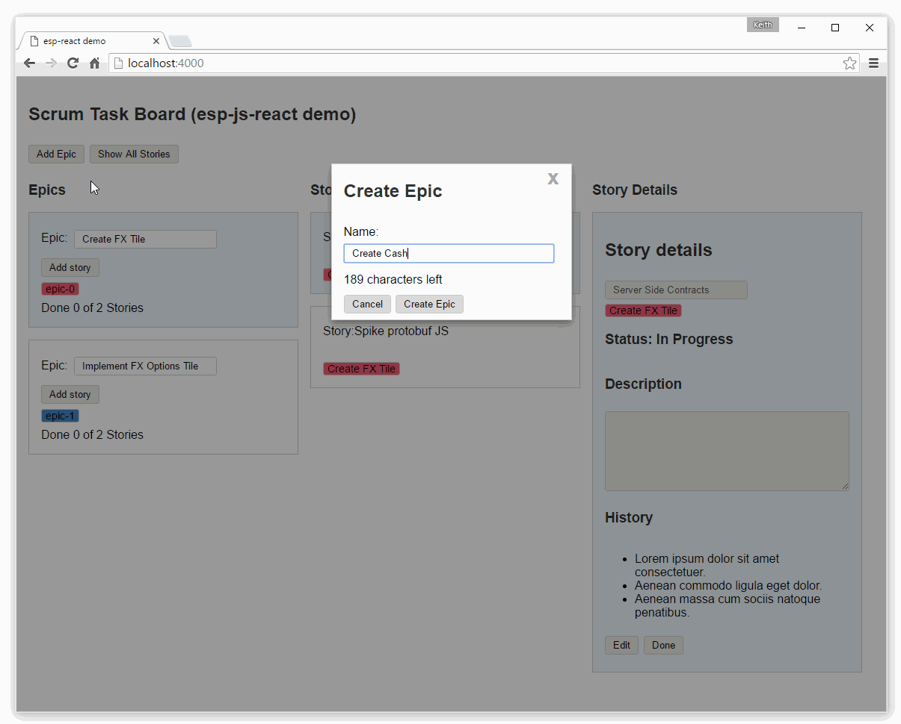

# Examples

The examples can be found in the [examples](https://github.com/esp/esp-js/tree/master/examples/) directory.

## ESP-JS API Examples

Several example bundled into a single script to demo various aspects of the API.

Checkout the [readme](https://github.com/esp/esp-js/tree/master/examples/esp-js-api) with the example for more info.

## ESP-JS-DI API Examples

Checkout the [readme](https://github.com/esp/esp-js/tree/master/examples/esp-js-di-api) with the example for more info.

## ESP Agile board

This [example](https://github.com/esp/esp-js/tree/master/examples/esp-js-react-agile-board) demonstrates a simple agile planning board.
It uses both [esp-js](https://www.npmjs.com/package/esp-js) and [esp-js-react](https://www.npmjs.com/package/esp-js-react) to build a unidirectional, model first application.

## Composite (multi module) Trading Application

This [example](https://github.com/esp/esp-js/tree/master/examples/esp-js-ui-module-based-app) demonstrates a basic multi module trading application architecture.
It uses all of the ESP package to show how a modular system can be built. 