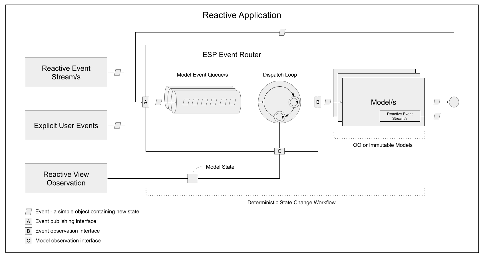

# Event State Processor (ESP) Documentation

ESP gives you the ability to manage changes to a model in a deterministic event driven manner.
It does this by adding specific processing workflow around changes to state. 

ESP was born out of the need to manage complex streaming state in reactive applications.
A pitfall of pure reactive applications is that state gets held up in observable sequences, there is no central business model to manage state in these sequences.
Streaming reactive patterns are great for pure data or event procurement, triggering workflows and so on, however are poor for complex business modeling.
Inherently, observable logic often gets intermingled with business modeling making both reasoning and maintenance hard.
Business modeling requires a more structured approach that's free from observable plumbing, easy reason with, easy to test and easier to maintain. 

ESP solves this by placing an ordered queue of state change events in front of a well structured model.
The models in your application can be either immutable or object oriented, and are by and large free from reactive plumbing concerns.
Business modeling is more deteministic, well structured and testable as the model only ever changes by one event at a time.
Central to ESP's design is an event `Router`.
This object manages the state change workflow for all models in the system.
It does this by providing A) an event publishing interface to change state, B) an event observation interface to mutate state, and C) a model observation interface to observe state. 
The below diagram shows this.

{: .align-center}

Over time additional libraries have been added to ESP to help build very large Single Page Apps (SPAs) in React. 
Some high level features include:
* Multiple models - a single `Router` can host multiple dependent or independent models with corresponding views and their own render cycles.
* Different state management patterns - use either object orientated or functional/immutable paradigms. 
* View creation functionality - gives the ability to host multiple instances of the same type of view.
* Dynamic view binding via regions - ability to display a view in a region without that region having a hard reference to the view.
* Application modules - collections of views which can be loaded separately and dynamically.
* View/Module/Object scoping and lifecycle management via dependency injection


The core ESP pattern was created before Redux or Flux were widely popular, as it turns out it's a very similar pattern. 
ESP could be thought of as an implementation of the uni directional message flow pattern.
It's core use case was to build complex real time reactive SPAs with multiple independent views.
Overtime it's evolved but the core use case has not changed.
This use case has steered the additional ESP libraries, they provide many features for large composite application development.



## Do you need ESP?

ESP tends to work well if you have these sorts of requirements:

* You're building large composite application, potentially with multiple development teams. 
* You're application is multi-tiered and decoupled - views can be grouped into modules, services can be reused amongst modules/views.
* You building a 'micro front end' SPA and want to release different parts of it independently. 
* You are dealing with a large amount of state, complex screens with 20-200+ inputs, various workflows or maybe different representations of the same data.
* Your have real time requirements and need reactive modeling APIs to manage complex business logic.

## Where can it be used?

ESP can be used on both client and servers, anywhere you have complex real-time and in-memory state that requires modelling.

Within your application you may have several independent areas that manage complex state, each of these could be candidates for ESP.

*	On the client it can be used to process state for a complex screen or a set of related and complex screens.
*	It can be used to model things to that don't have a screen - log in flows, app bootstraping, notifications.
*	On the server you might use it to model push-based user state and general internal server state. 
    It provides a deterministic method to modify and observe such state.

## Talks

While a bit dated (particularly around OO vs Immutable), the below 25min talk on ESP at the [React London Meetup](https://meetup.react.london/) covers core concepts which are still valid today.



Slides for the talk are available [here](http://goo.gl/40jie4).